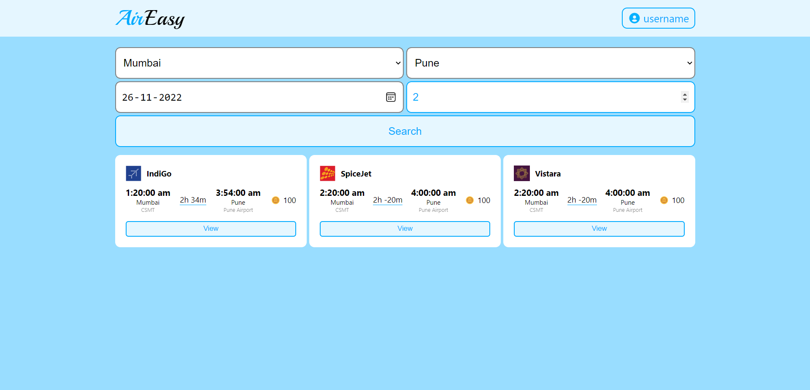
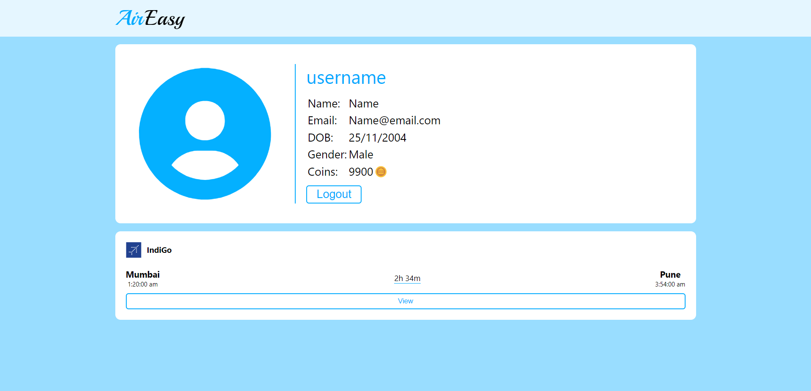
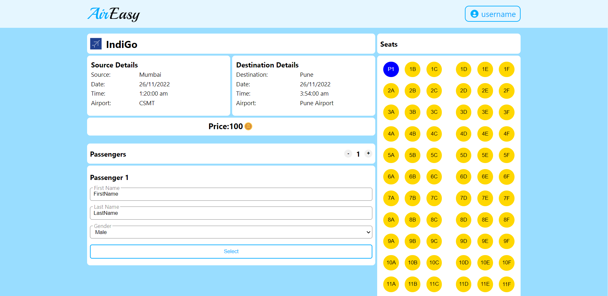
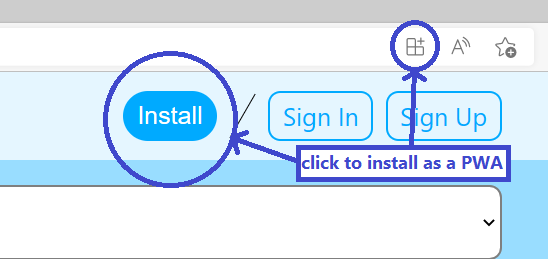

# Flight Booking System

Visit Website : [Flight Booking Sytem](https://vishal-kamath.github.io/Flight-Booking-System-React.github.io/)

## Description:
The objective of this project is to create a dummy Flight Booking System that allows users to book flights with seat selection, the users must also create a user account to which his booking history, his user details and inboxes will be linked.

Website Home Page:

User Page:

Booking Page:

## PWA (Progressive Web Apps)
Our website is also acts as a PWA. you can download the website and run it on your device as any other application.
 

